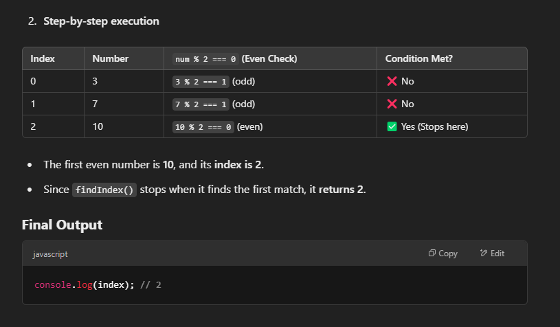

# How `findIndex()` in JavaScript works

The `findIndex()` method in JavaScript is used to find the index of the first element in an array that meets a specific condition. If no element matches the condition, it returns -1.

## Syntax:

```js
array.findIndex((element, index, array) => condition);
```

- It takes a callback function as an argument.
- The callback function receives three parameters:
  - `element` → The current element in the array.
  - `index` (optional) → The index of the current element.
  - `array` (optional) → The entire array.

## Example 1: Find the first even number

```js
const numbers = [3, 7, 10, 15, 20];

const index = numbers.findIndex((num) => num % 2 === 0);

console.log(index); // Output: 2 (because 10 is the first even number at index 2)
```

#### Understanding the logic

How `findIndex()` works

- It loops through the array and checks each element one by one.
- It stops as soon as it finds the first element that satisfies the condition (`num % 2 === 0`).
- If no element matches, it returns `-1`.

#### Step-by-step Execution



## Example 2: Find an object in an array

```js
const users = [
  { id: 1, name: "Alice" },
  { id: 2, name: "Bob" },
  { id: 3, name: "Charlie" },
];

const index = users.findIndex((user) => user.name === "Bob");

console.log(index); // Output: 1 (Bob is at index 1)
```

### Example 3: When no match is found

```js
const numbers = [1, 3, 5, 7];

const index = numbers.findIndex((num) => num > 10);

console.log(index); // Output: -1 (because no number is greater than 10)
```
