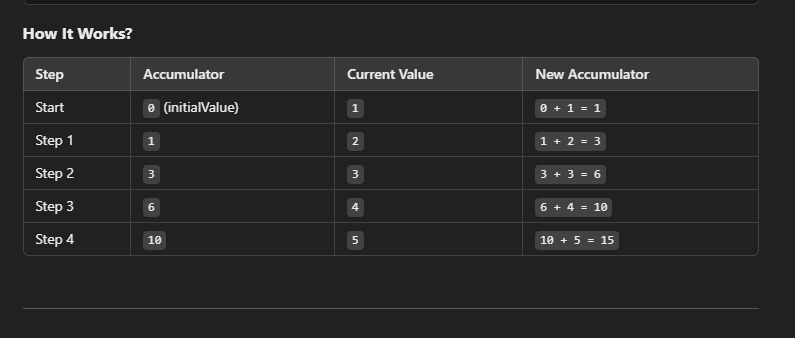
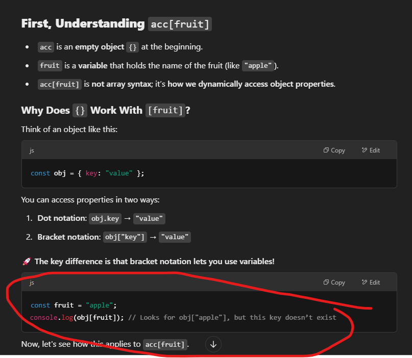
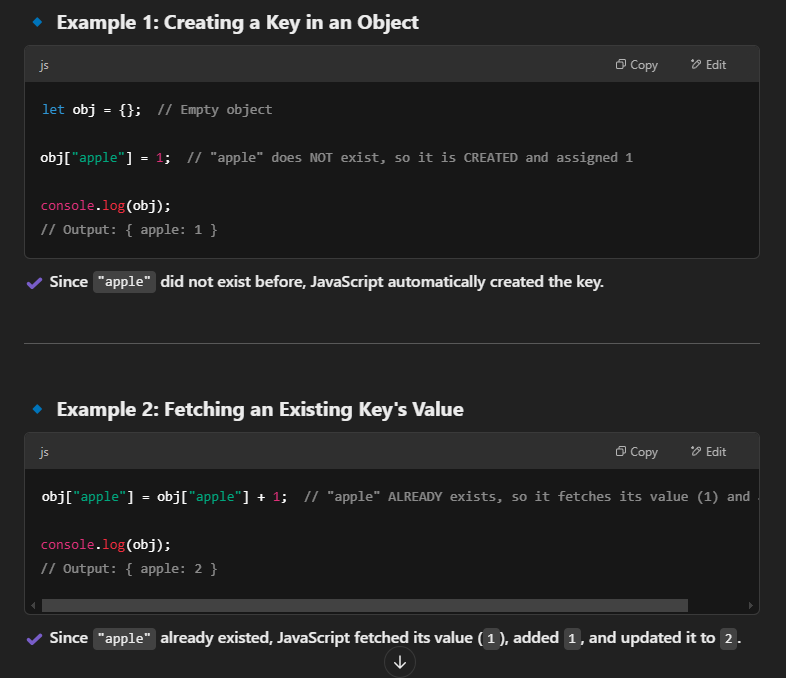
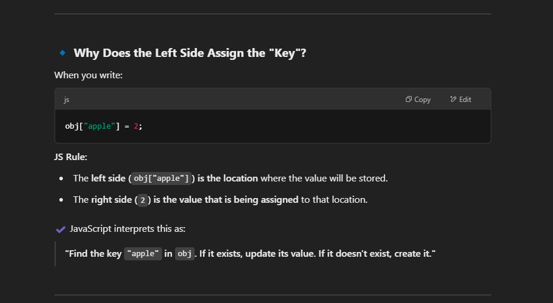

# How `reduce()` in JavaScript works

The `.reduce()` method in JavaScript is used to reduce an array to a single value by applying a function repeatedly. It is commonly used for summing numbers, finding averages, or transforming data.

## Syntax

```js
array.reduce(callback, initialValue);
```

## <p style="color:deepskyblue">Example 1: Sum of Numbers</p>

```js
const numbers = [1, 2, 3, 4, 5];

const sum = numbers.reduce((accumulator, currentValue) => {
  return accumulator + currentValue;
}, 0);

console.log(sum); // Output: 15
```

#### How it Works?



## <p style="color:deepskyblue">Example 3: Count Occurrences in an Array</p>

```js
const fruits = ["apple", "banana", "apple", "orange", "banana", "apple"];

const count = fruits.reduce((acc, fruit) => {
  acc[fruit] = (acc[fruit] || 0) + 1; // Increment count for each fruit
  return acc; // Return the updated accumulator object
}, {}); // Initial accumulator is an empty object {}

console.log(count);
// Output: { apple: 3, banana: 2, orange: 1 }
```

### First, Understanding `acc[fruit]`

- `acc` is an empty object {} at the beginning.
- `fruit` is a variable that holds the current name of the fruits (like "apple", "banana", "apple", "orange", etc).



### Step-by-Step Execution

We start with:

```js
const acc = {}; // Empty object
const fruit = "apple";
```

Now, what happens when we do `acc[fruit]`?

# 1️. First `"apple"`

```js
acc[fruit] = (acc[fruit] || 0) + 1;
```

Since `acc` is empty (`{}`), `acc["apple"]` does not exist yet.

> `acc["apple"]` is `undefined`, so:

```js
acc["apple"] = (undefined || 0) + 1;
acc["apple"] = 0 + 1;
acc["apple"] = 1;
```

🔹 Now, acc = `{ apple: 1 }`

- <p style="color: yellow">
    We know <code>acc</code> is an empty object <code>acc = {}</code>, so by using 
    <code>acc["apple"] = 1</code>, we are assigning a new key-value pair to <code>acc</code>, 
    where <code>"apple"</code> is the key and <code>1</code> is the value. (e.g <code>acc = {apple:1}</code>)
  </p>

# 2. `"banana"` Comes Next

Now `fruit = "banana"`, and we execute:

```js
acc[fruit] = (acc[fruit] || 0) + 1;
```

Since `acc["banana"]` does not exist, it is `undefined`.

- `acc["banana"]` is `undefined`, so:

```js
acc["banana"] = (undefined || 0) + 1;
acc["banana"] = 0 + 1;
acc["banana"] = 1;
```

🔹Now, `acc = { apple: 1, banana: 1 }`

- <p style="color:yellow">
    Because we are returning the updated accumulator object 
    <code>return acc; // Return the updated accumulator object</code> 
    in the reduce function, <code>acc</code> keeps getting updated on each iteration. 
    After processing two fruits, <code>acc</code> becomes <code>{ apple: 1, banana: 1 }</code>.
  </p>

# 3. `"apple"` Comes Again

Now `fruit = "apple"` again, and we execute:

```js
acc[fruit] = (acc[fruit] || 0) + 1;
```

- <p style="color:yellow">In the accumulator, we currently have this object <code>acc = { apple: 1, banana: 1 }</code>, so if we fetch <code>acc[fruit]</code>, the value will be <code>1</code>.
  </p>

```js
acc["apple"] = (1 || 0) + 1;
acc["apple"] = 1 + 1;
acc["apple"] = 2;
```

🔹 Now, `acc = { apple: 2, banana: 1 }`

- First time (`acc[fruit]` doesn’t exist):

  - JavaScript creates a new key in the object and assigns it `1`.

- Next times (`acc[fruit]` exists):
  - JavaScript retrieves the existing `value`, increments it, and updates it.

And the iteration will continue till the last variable.

## <p style="color:deepskyblue">Why JavaScript first creates a key when it doesn't exist, but later it fetches its value</p>



### Why Does the Left Side Assign the "Key"?


