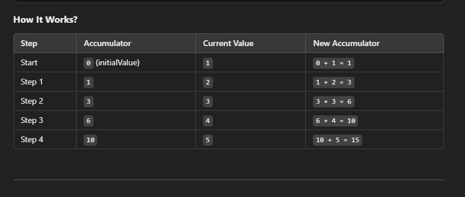

# How `reduce()` in JavaScript works

The `.reduce()` method in JavaScript is used to reduce an array to a single value by applying a function repeatedly. It is commonly used for summing numbers, finding averages, or transforming data.

### Syntax

```js
array.reduce(callback, initialValue);
```

### Example 1: Sum of Numbers

```js
const numbers = [1, 2, 3, 4, 5];

const sum = numbers.reduce((accumulator, currentValue) => {
  return accumulator + currentValue;
}, 0);

console.log(sum); // Output: 15
```

#### How it Works?


